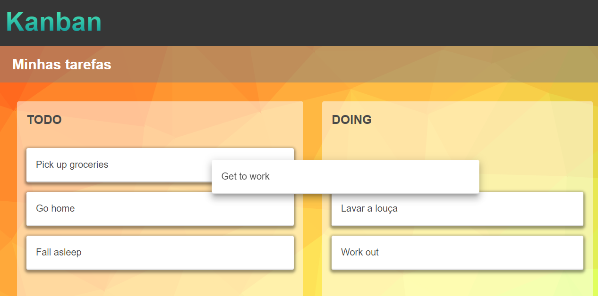

# angular_kanban

A kanban with draggable cards made with Angular CDK

Items can be moved between columns.
Soon, I intend create buttons to add columns and tasks or edit column and board name.

This project was made following this tutorial from Devstackr.
[Kanban w/ Draggable Cards in Angular :: Drag and Drop](https://www.youtube.com/watch?v=YGCDAXFWAZo&list=PLIjdNHWULhPQ2JUw3SX5mPCmjLGWmXqnu)
